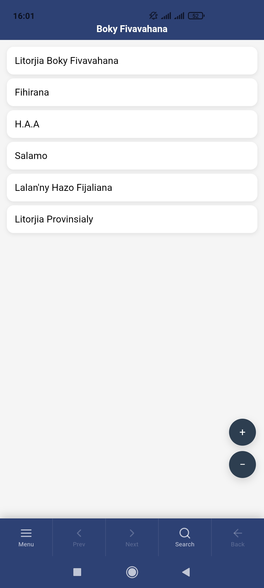
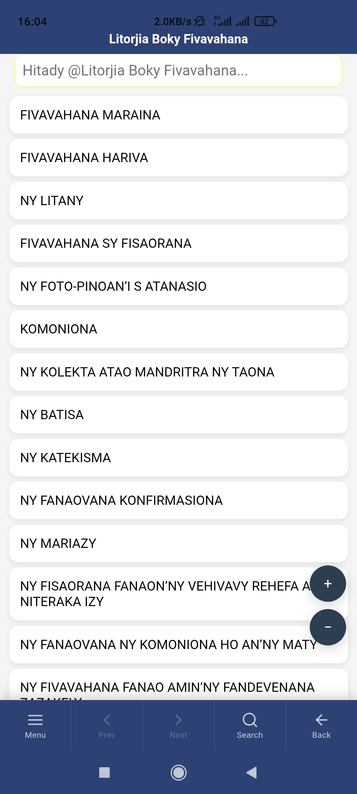

# Boky Fivavahana

**Boky Fivavahana Anglikana** — Madagascar's Anglican common prayer book app for Android.

> _Voninahitra ho an'Andriamanitra irery ihany._

---

## About

Boky Fivavahana is a free, offline-first Android app providing the full content of the Malagasy Anglican prayer book. It contains liturgies, hymns, psalms, and prayers in Malagasy, organized for easy navigation and reading.

### Books included

- **Litorjia Boky Fivavahana** — Anglican liturgy
- **Fihirana** — Hymns
- **Hanandratra Anao Aho (H.A.A)** — Praise hymns
- **Salamo** — Psalms
- **Lalan'ny Hazo Fijaliana** — Stations of the Cross
- **Litorjia Provinsialy** — Provincial liturgy

---

## Features

- Fully offline — no internet required after install
- Fast full-text search across all books and sections
- Section-scoped search within a book
- Adjustable font size for comfortable reading
- Prev / Next navigation between titles within a book
- Page-number sorted view for hymn books
- Bottom navigation bar for one-handed use

## Install

- This app works on any Android 7.0 (N) up to Android 16
- Grab the latest version of the [boky-fivavahana.apk](https://github.com/lightm111/boky-fivavahana/releases/latest) release
- Enable "Installation fronm unknown sources" then install

---

## Screenshots

  

---

## Tech Stack

Built with plain HTML, CSS, and JavaScript, packaged as a native Android app using [Capacitor v8](https://capacitorjs.com/).
No frameworks, no bundler — the web layer runs directly as static files (for now).

---

## Build Instructions

### Prerequisites

- Node.js 18+
- Android Studio with Android SDK
- Java 17+

### Steps

```bash
# 1. Install dependencies
npm install

# 2. Build web assets
npm run build:web

# 3. Sync with Android project
npx cap sync android

# 4. Open in Android Studio and build APK
npx cap open android
```

---

## License

This project is released under the [GNU General Public License v3.0](LICENSE).

---

## Contact

For bug reports or feedback, open an issue or:

- Email: tsiorymanana7@gmail.com
- Phone: +261347048504

Credits to _FEEM NTIC — Lead Code Group_.
